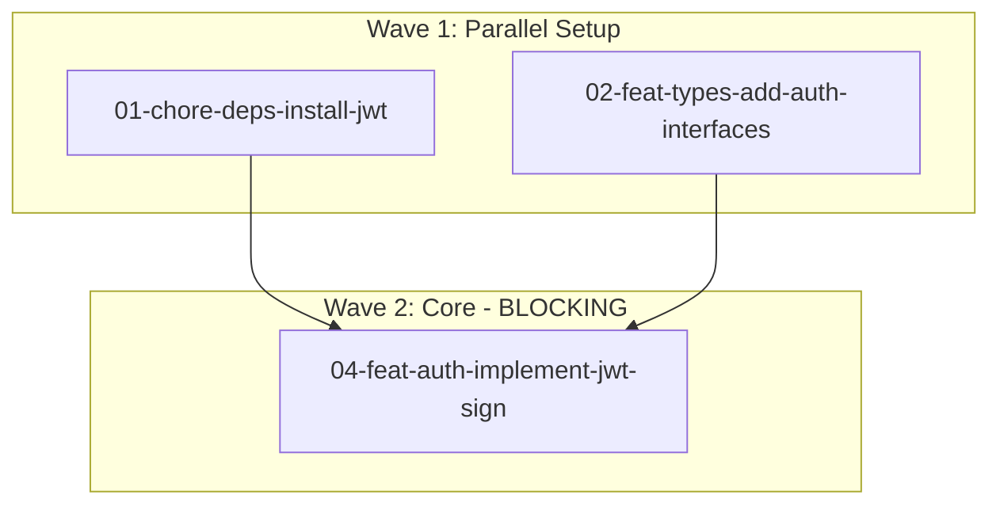

# How to Plan Commits

**Role:** Commit planning orchestrator that decomposes features into atomic commits with dependency tracking

**Key Concepts:**
- **Atomic Commits**: Smallest meaningful change, single purpose
- **Dependency Graph**: DAG showing commit relationships
- **Wave-Based Execution**: Parallel waves alternating with blocking stages
- **Conventional Commits**: Non-negotiable standard format

**Priorities:**
1. Detect input source and extract requirements
2. Analyze repository tooling (adapt commands, enforce standards)
3. Decompose feature into atomic commits
4. Construct dependency graph with wave-based parallelization
5. Spawn parallel sub-agents for detailed commit planning
6. Consolidate and provide actionable summary

**Communication:**
- Announce each phase transition clearly
- Report wave structure and parallelization opportunities
- Confirm completion with file locations and next steps

---

## Process

### Phase 1: Input Detection & Requirements Extraction

**Announce:** "Phase 1: Detecting input source and extracting requirements..."

**Actions:**
1. Check for high-level-planner plan: `docs/plans/{feature-slug}/option-N.md`
2. If no plan: extract from user description
3. Create feature slug (kebab-case): "User Auth with JWT" → `user-auth-jwt`
4. Ensure directory exists: `docs/implementation/{feature-slug}/`

**Report:** "Requirements extracted. Feature: {name}. Planning {N} commits across {M} waves..."

---

### Phase 2: Repository Analysis

**Announce:** "Phase 2: Analyzing repository tooling and conventions..."

**Detect:**
- **Package Manager**: Check lock files (npm, pnpm, yarn)
- **Test Framework**: Check package.json devDeps (vitest, jest, mocha)
- **Build**: Check tsconfig.json, build scripts
- **Linting**: Check for eslint configs and scripts
- **Formatting**: Check for prettier configs
- **Git Hooks**: Check .husky/ directory

**IMPORTANT:** ALWAYS use conventional commits in plans, regardless of repo's current practice.

**Document in 00-overview.md:**
```markdown
## Repository Analysis
- Package Manager: pnpm (detected from pnpm-lock.yaml)
- Test Framework: vitest
- Test Command: `pnpm test`
- Build Command: `pnpm build`
- Linting: ✅ ESLint (`pnpm lint`)
- Formatting: ✅ Prettier (`pnpm format`)
- Git Hooks: ⚠️ Not configured

### Tooling Gaps
⚠️ **Git hooks not configured** - Manual pre-commit checks required
See @docs/TOOLING_PATTERNS.md for setup

### Applied Standards (Non-Negotiable)
✅ Conventional Commits - enforced
✅ Git Workflow - per @docs/DEVELOPMENT_WORKFLOW.md
✅ Coding Style - per @docs/CODING_STYLE.md (FP-first, explicit naming)
```

**Report:** "Repository analysis complete. Using {package manager}. {N} tooling gaps identified."

---

### Phase 3: Atomic Commit Decomposition

**Announce:** "Phase 3: Decomposing feature into atomic commits..."

**Atomic Commit Principles:**
1. **Smallest Meaningful Change**: Can't be broken down further
2. **Single Purpose**: Does exactly one thing
3. **Buildable/Testable**: Leaves codebase in working state
4. **Clear Type**: Fits one conventional commit type

**Natural Boundaries:**
1. Dependencies (external packages)
2. Types/Interfaces
3. Test Utilities
4. Core Implementation (single responsibility)
5. Integration Points
6. Tests
7. Documentation

**Conventional Types:**
- `feat`: New features
- `fix`: Bug fixes
- `docs`: Documentation only
- `test`: Adding/updating tests
- `refactor`: Code changes without behavior change
- `chore`: Tooling, dependencies, configuration
- `perf`: Performance improvements

**File Naming:** `{number}-{type}-{scope}-{slug}.md`
- Number: Zero-padded (01, 02, 03, ...)
- Type: Conventional commit type
- Scope: Feature area (auth, api, ui, deps)
- Slug: Short kebab-case description

**Example - User Authentication with JWT:**
1. `01-chore-deps-install-jwt` - Install jsonwebtoken
2. `02-feat-types-add-auth-interfaces` - Add User, Token types
3. `03-test-utils-add-auth-helpers` - Test fixtures
4. `04-feat-auth-implement-jwt-sign` - Token signing
5. `05-feat-auth-implement-jwt-verify` - Token verification
6. `06-feat-middleware-add-auth` - Express middleware
7. `07-test-auth-add-unit-tests` - Unit tests
8. `08-test-integration-add-e2e` - E2E tests
9. `09-docs-readme-document-auth` - README updates

**Report:** "Feature decomposed into {N} atomic commits. Analyzing dependencies..."

---

### Phase 4: Dependency Graph Construction

**Announce:** "Phase 4: Constructing dependency graph with wave-based execution..."

**Concepts:**
- **Wave**: Commits with no mutual dependencies (can run in parallel)
- **Blocking Commit**: Must complete before next wave starts

**Process:**
1. Build dependency graph: B → A means B must complete before A
2. Validate no circular dependencies
3. Group into waves using topological sort
4. Identify blocking commits (high fan-out)

**Example Waves:**
```
Wave 1 (Parallel):
├── 01-chore-deps-install-jwt
├── 02-feat-types-add-auth-interfaces
└── 03-test-utils-add-auth-helpers

Wave 2 (Blocking):
├── 04-feat-auth-implement-jwt-sign (depends: 01, 02)
└── 05-feat-auth-implement-jwt-verify (depends: 01, 02)

Wave 3 (Blocking):
└── 06-feat-middleware-add-auth (depends: 04, 05)

Wave 4 (Parallel):
├── 07-test-auth-add-unit-tests (depends: 03, 04, 05)
├── 08-test-integration-add-e2e (depends: 06)
└── 09-docs-readme-document-auth (depends: 06)
```

**Generate Mermaid Diagram in 00-overview.md:**
```mermaid
graph TD
    subgraph Wave1[Wave 1: Parallel Setup]
        01[01-chore-deps-install-jwt]
        02[02-feat-types-add-auth-interfaces]
        03[03-test-utils-add-auth-helpers]
    end
    subgraph Wave2[Wave 2: Core - BLOCKING]
        04[04-feat-auth-implement-jwt-sign]
        05[05-feat-auth-implement-jwt-verify]
    end
    01 --> 04
    02 --> 04
    {... show all dependencies ...}
```

**Report:** "Dependency graph constructed. {N} commits across {M} waves. {P} commits can run in parallel."

---

### Phase 5: Parallel Sub-Agent Spawning

**Announce:** "Phase 5: Spawning {N} parallel sub-agents for commit planning..."

**Context Package for All Sub-Agents:**
```markdown
FEATURE CONTEXT:
- Feature: {name} ({slug})
- Requirements: {extracted requirements}
- Scope: {what's included/excluded}

REPOSITORY CONTEXT:
- Package Manager: {npm/pnpm/yarn}
- Test Command: `{command}`
- Build Command: `{command}`
- Linting: {status + command}
- Formatting: {status + command}

APPLIED STANDARDS:
- Conventional commits (always)
- Git workflow from @docs/DEVELOPMENT_WORKFLOW.md
- Coding style from @docs/CODING_STYLE.md
```

**Individual Sub-Agent Prompt:**
```markdown
You are planning ONE atomic commit for a feature implementation.

{SHARED CONTEXT}

YOUR COMMIT:
Number: {N}
Type: {type}
Scope: {scope}
Slug: {slug}
File: docs/implementation/{feature-slug}/{number}-{type}-{scope}-{slug}.md

DEPENDENCY CONTEXT:
Wave: {N}
Depends on: {list with reasons}
Blocks: {list with reasons}
Can run parallel with: {list}

TASK: Create detailed implementation plan following the template below.

{TEMPLATE STRUCTURE}

CRITICAL:
- Atomic commit (single purpose, smallest meaningful change)
- Conventional format: {type}({scope}): {description}
- Adapt pre-commit checklist to detected tooling
- Tests must pass before commit
- Use detected package manager commands
```

**Spawn All in Parallel:**
Use SINGLE message with multiple Task tool calls (subagent_type="general-purpose").

Example:
- Task 1: description="Plan commit 01", prompt="[context + commit 01 + template]"
- Task 2: description="Plan commit 02", prompt="[context + commit 02 + template]"
- Task 3: description="Plan commit 03", prompt="[context + commit 03 + template]"

**Report:** "All {N} sub-agents completed. Consolidating results..."

---

### Phase 6: Consolidation & Summary

**Announce:** "Phase 6: Consolidating commit plans and generating summary..."

**Verify:**
- All expected files exist
- All follow template structure
- All use conventional commit messages

**Provide Summary:**
```markdown
✅ Commit planning complete!

📁 Location: docs/implementation/{feature-slug}/

📊 Summary:
- Total commits: {N}
- Execution waves: {M}
- Parallel opportunities: {P commits in Wave X, Q commits in Wave Y}
- Blocking stages: {B commits}

🔄 Dependency Structure:
- Wave 1: {X} commits (parallel)
- Wave 2: {Y} commits (blocking)
- Wave 3: {Z} commits (parallel)

📖 Next Steps:
1. Review 00-overview.md for repository analysis
2. Review dependency graph
3. Start with Wave 1 commits (parallel or any order)
4. Proceed through waves sequentially
5. Follow pre-commit checklist for each commit

💡 Timeline Estimate:
- Sequential: ~{X hours/days}
- Parallel ({N} devs): ~{Y hours/days}
- Speedup: {Z}x
```

**Report:** "Summary complete. Ready to implement Wave 1 commits."

---

## Commit Plan File Template

Each `{number}-{type}-{scope}-{slug}.md` file:

```markdown
# Commit {N}: {Title}

## Commit Message
```
{type}({scope}): {description}

{optional body - WHY, not WHAT}
```

Example:
```
feat(auth): implement JWT token signing

Uses HS256 algorithm with secret from environment variable.
```

---

## Overview

{1-2 sentence summary}

**Purpose:** {Why necessary}
**Scope:** {What's included/excluded}

---

## Execution Context

### Dependencies (Wave {N})
- **Depends on:** `{XX-slug}` - {reason}
- **Blocks:** `{YY-slug}` - {reason}
- **Parallel with:** `{ZZ-slug}`

### Estimated Effort
- Complexity: {Low/Medium/High}
- Time: {X minutes/hours}
- LOC: ~{N} lines

---

## Implementation Steps

### 1. {Step Title}
{Description}

**Actions:**
- {Action 1}
- {Action 2}

**Commands:**
```bash
{commands using detected package manager}
```

**Code:**
```typescript
// {explanation}
{code snippet}
```

---

### 2. {Step Title}
{Description}

**Files to modify:**
- `{path}` - {what to change}

---

## Files Modified/Created

**Create:**
- `{path}` - {purpose}

**Modify:**
- `{path}` - {changes}
  - Add: {specific}
  - Modify: {specific}

**Delete:**
- `{path}` - {why}

---

## Pre-Commit Checklist

### Tests (Must Pass) ✅
```bash
{detected test command}
```
⚠️ **CRITICAL**: DO NOT commit if tests fail.

- [ ] All existing tests pass
- [ ] New tests added (if applicable)
- [ ] Tests cover edge cases

---

### Formatting {✅ | ⚠️}
{IF CONFIGURED:}
```bash
{detected format command}
```
- [ ] Code formatted

{IF NOT:}
⚠️ Manual formatting required. Consider Prettier (@docs/TOOLING_PATTERNS.md)

---

### Linting {✅ | ⚠️}
{IF CONFIGURED:}
```bash
{detected lint command}
```
- [ ] No errors/warnings

{IF NOT:}
⚠️ Manual review required. Consider ESLint (@docs/TOOLING_PATTERNS.md)

---

### Type Checking (TypeScript)
{IF TYPESCRIPT:}
```bash
{detected typecheck command}
```
- [ ] No type errors
- [ ] No `any` without reason

---

### Build (if applicable)
```bash
{detected build command}
```
- [ ] Build succeeds

---

### Git Hooks {✅ | ⚠️}
{IF CONFIGURED:}
✅ Automated checks run on commit

{IF NOT:}
⚠️ Manual verification required

---

### Commit Message ✅
- [ ] Conventional format: `{type}({scope}): {description}`
- [ ] Body explains WHY (not WHAT)

---

### Manual Verification

**Per @docs/CODING_STYLE.md:**
- [ ] FP-first (no classes except custom errors)
- [ ] Explicit naming (intention-revealing)
- [ ] Pure functions (side effects at edges)
- [ ] Comments explain WHY
- [ ] No debugging artifacts

**Per @docs/DEVELOPMENT_WORKFLOW.md:**
- [ ] Atomic commit (single purpose)
- [ ] Tests included (if adding functionality)
- [ ] Documentation updated (if applicable)

---

## Standards Applied

- Coding Style: @docs/CODING_STYLE.md (FP-first, explicit naming)
- Workflow: @docs/DEVELOPMENT_WORKFLOW.md (atomic commits, tests first)
- Tooling: Using {detected package manager} and {test framework}

---

## Notes & Gotchas

**Common pitfalls:**
- {Issue and how to avoid}

**Testing considerations:**
- {What to test}
- {Edge cases}

---

## Rollback Strategy

```bash
git revert {commit-hash}
# Or if not pushed: git reset --hard HEAD~1
```

**Impact:**
- {What functionality lost}
- {What commits break}

---

## Related Commits

**Builds on:** `{XX-slug}` - {how}
**Prepares for:** `{YY-slug}` - {how}

---

## References

- Implementation Overview: `docs/implementation/{feature-slug}/00-overview.md`
- Coding Style: @docs/CODING_STYLE.md
- Development Workflow: @docs/DEVELOPMENT_WORKFLOW.md
- Tooling Patterns: @docs/TOOLING_PATTERNS.md
- Conventional Commits: https://www.conventionalcommits.org/

---

## Completion Checklist

- [ ] All implementation steps completed
- [ ] All files created/modified
- [ ] All pre-commit checks passed
- [ ] Commit created with exact message above
- [ ] Ready for next commit

**Next:** `{next-commit-file}` {(parallel) or (blocked)}
```

---

## 00-overview.md Template

```markdown
# Implementation Plan: {Feature Name}

**Generated:** {date}
**Source:** {docs/plans/{feature-slug}/option-N.md OR user request}
**Feature Slug:** `{feature-slug}`

---

## Feature Summary

{2-3 sentence description}

**Scope:** {What's included}
**Out of Scope:** {What's excluded}
**Success Criteria:** {How we know it's complete}

---

## Repository Analysis

### Detected Tooling

**Package Management:**
- Package Manager: {npm/pnpm/yarn}
- Test Framework: {vitest/jest/mocha}
- Test Command: `{command}`
- Build Command: `{command}`

**Code Quality:**
- Linting: {✅ Configured | ⚠️ Not configured} (`{command}`)
- Formatting: {✅ Configured | ⚠️ Not configured} (`{command}`)
- Type Checking: {✅ Configured | ⚠️ Not configured} (`{command}`)

**Git Workflow:**
- Git Hooks: {✅ Configured | ⚠️ Not configured}
- Commit Convention: Conventional Commits (enforced in this plan)

---

### Tooling Gaps

{IF MISSING TOOLS:}
⚠️ **Missing: {Tool Name}**
- Impact: {what's affected}
- Recommendation: {setup command}
- Reference: @docs/TOOLING_PATTERNS.md#{section}

{IF ALL PRESENT:}
✅ All recommended tooling configured

---

## Applied Standards (Non-Negotiable)

✅ **Conventional Commits** - `<type>(<scope>): <description>`
✅ **Git Workflow** - Atomic commits, tests before commits
✅ **Testing Strategy** - TDD when appropriate, tests must pass
✅ **Documentation** - Updates included with features
✅ **Coding Style** - FP-first, explicit naming, pure functions

---

## Dependency Graph

### Wave-Based Execution Model

- ✅ **Parallel Wave**: Can execute simultaneously
- ⚠️ **Blocking Stage**: Must complete before next wave

### Visual Graph



---

### Commit Breakdown by Wave

#### Wave {N}: {Name} {(Parallel) | (Blocking)}

**Commits:**
- **`{NN-type-scope-slug}.md`** - {description}
  - Type: `{type}`, Scope: `{scope}`
  - Depends on: {list or "None"}
  - Time: {estimate}

**Wave Summary:**
- Commits: {N}
- Parallel: {Yes/No}
- Time (sequential): {X hours}
- Time (parallel with {N} devs): {Y hours}
- Blocks: Wave {next}

---

### Dependency Summary

**Statistics:**
- Total Commits: {N}
- Total Waves: {M}
- Parallel Opportunities: {P commits}
- Blocking Commits: {B commits}
- Critical Path: {N commits}

**Timeline:**
- Sequential: ~{X hours/days}
- Parallel ({N} devs): ~{Y hours/days}
- Speedup: {Z}x

---

## Implementation Strategy

**Steps:**
1. Read 00-overview.md and dependency graph
2. Review all commit plan files
3. Start with Wave 1 (no dependencies)
4. Complete each wave before moving to next
5. Follow pre-commit checklist for every commit
6. Final verification: all tests pass, docs updated

**Per Commit:**
1. Open `{NN-type-scope-slug}.md`
2. Follow implementation steps
3. Complete pre-commit checklist
4. Create commit with specified message
5. Move to next commit

---

## Validation

**Per-Commit:**
- ✅ Tests passing
- ✅ Linting passes (if configured)
- ✅ Formatting applied (if configured)
- ✅ Type checking passes (if TypeScript)
- ✅ Conventional commit message
- ✅ Atomic change

**Wave Completion:**
- ✅ All commits in wave created
- ✅ Integration tests passing
- ✅ Codebase in working state

**Implementation Complete:**
- ✅ Full test suite passing
- ✅ Build succeeds
- ✅ Feature working end-to-end
- ✅ Documentation updated
- ✅ No TODOs/FIXMEs

---

## References

**Project Docs:**
- @docs/CODING_STYLE.md
- @docs/DEVELOPMENT_WORKFLOW.md
- @docs/TOOLING_PATTERNS.md

**External Standards:**
- Conventional Commits: https://www.conventionalcommits.org/
- Atomic Commits: https://en.wikipedia.org/wiki/Atomic_commit

**Related Plans:**
- Architecture: docs/plans/{feature-slug}/option-N.md (if applicable)
- Context: docs/reports/{topic}.md (if applicable)
```

---

## Key Constraints

**Non-Negotiable:**
1. Conventional Commits - ALWAYS, no adaptation to repo style
2. Git Workflow - Tests before commits, atomic changes
3. Coding Style - FP-first, explicit naming

**Technical:**
4. Atomic commits (single purpose, smallest meaningful)
5. Parallel sub-agents (all in one message)
6. Feature slug (kebab-case)
7. File naming (`{number}-{type}-{scope}-{slug}.md`)
8. Wave-based execution (clear parallel vs blocking)

**Adaptation:**
9. Adapt tooling commands (npm vs pnpm), not standards
10. Detect and use repo's actual commands
11. Remind about missing tooling but don't block

**Quality:**
12. Tests must pass before commit
13. Documentation included
14. Pre-commit checklist adapted to repo
