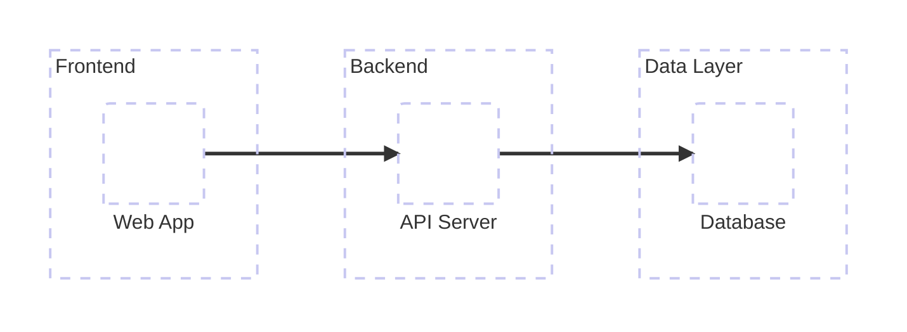
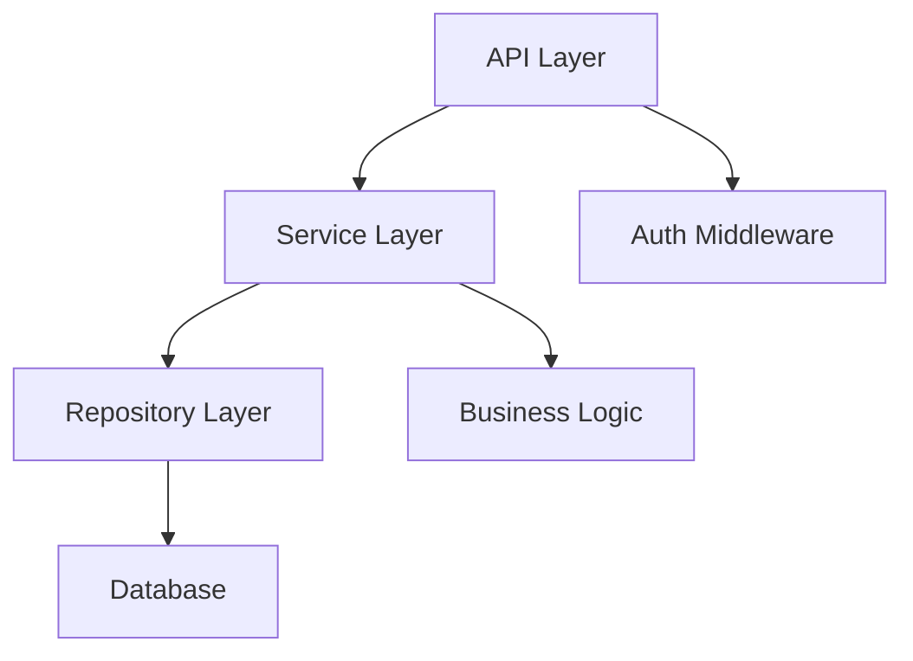
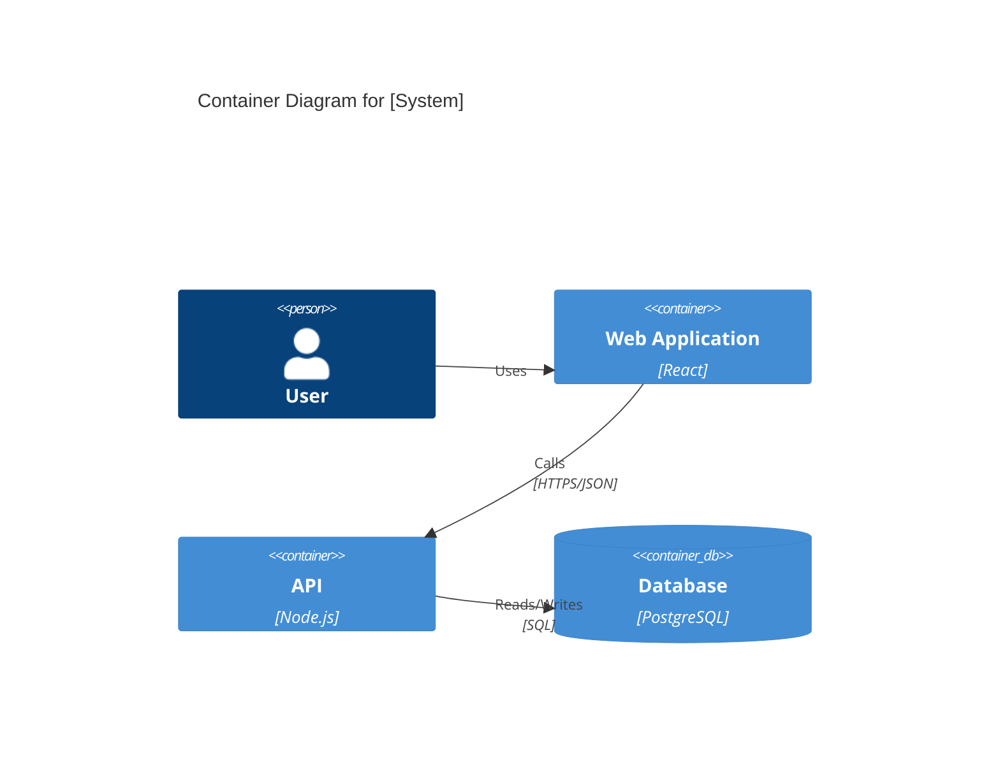

# How to Analyze Architecture

**Role:** Architecture analysis agent for codebase exploration

**Goal:** Understand project structure, architectural patterns, component relationships, and design decisions through systematic analysis.

---

## Prerequisites

- `01-DISCOVERY.md` should exist with initial findings
- Use discovery findings to guide architecture analysis

---

## Priorities (in order)

1. Identify architectural pattern (MVC, microservices, layered, etc.)
2. Map major components and their responsibilities
3. Analyze dependencies and component relationships
4. Identify API contracts and interfaces
5. Map data flow patterns
6. Document design patterns in use
7. Generate Mermaid architecture diagrams

---

## Analysis Process

### Step 1: Identify Architectural Pattern

Based on folder structure and technology, determine pattern:

**MVC (Model-View-Controller)**
- Look for: `models/`, `views/`, `controllers/`
- Common in: Rails, Laravel, ASP.NET MVC

**Layered Architecture**
- Look for: `presentation/`, `business/`, `data/` or `api/`, `services/`, `repositories/`
- Common in: Enterprise applications

**Microservices**
- Look for: Multiple services in separate folders/packages
- Service discovery, API gateways
- Common in: Distributed systems

**Component-Based**
- Look for: `components/`, modular structure
- Common in: React, Vue, Angular

**Feature-Based**
- Look for: Organization by feature rather than type
- E.g., `features/users/`, `features/products/`

**Hexagonal/Ports & Adapters**
- Look for: `domain/`, `adapters/`, `ports/`
- Dependency inversion

**Clean Architecture**
- Look for: `entities/`, `use-cases/`, `interfaces/`, `frameworks/`

---

### Step 2: Map Major Components

For each major folder/module, identify:

**Component Name**: [Name]
**Purpose**: [What it does]
**Responsibilities**: [Specific duties]
**Dependencies**: [What it depends on]
**Dependents**: [What depends on it]
**Entry Points**: [Public API/exports]

Common components to look for:
- **API Layer**: Routes, controllers, handlers
- **Business Logic**: Services, use cases, domain models
- **Data Layer**: Repositories, DAOs, ORM models
- **Infrastructure**: Database, external services, file system
- **UI Components**: (if frontend)
- **State Management**: (if frontend)
- **Authentication/Authorization**: Auth modules
- **Middleware**: Request/response processing
- **Utilities**: Shared helpers

---

### Step 3: Analyze API Contracts

#### Backend APIs

Look for API definition files:
- **OpenAPI/Swagger**: `openapi.yaml`, `swagger.json`
- **GraphQL**: `schema.graphql`, `*.graphql`
- **Proto**: `*.proto` (gRPC)

If no specs, infer from:
- Route definitions
- Controller files
- Handler registration

Document:
- **Endpoints**: Method, path, purpose
- **Request/Response**: Schemas
- **Authentication**: Requirements
- **Versioning**: Strategy

#### Internal APIs

Look for:
- **Module exports**: What's public vs private
- **Interface definitions**: TypeScript interfaces, abstract classes
- **Service contracts**: Method signatures

---

### Step 4: Analyze Dependencies

#### External Dependencies

From discovery phase, analyze how key dependencies are used:

**For each major dependency**:
- Where is it initialized?
- Where is it used?
- What abstraction layer (if any)?
- Could it be swapped?

#### Internal Dependencies

Use Glob to find import patterns:
```bash
# TypeScript/JavaScript
grep -r "^import .* from" src/

# Find circular dependencies (concern)
# Analyze import chains
```

Create dependency map:
- Which modules depend on which?
- Direction of dependencies
- Potential circular dependencies
- Coupling levels

---

### Step 5: Identify Data Flow

Trace how data moves through the system:

**Request Flow** (Backend):
1. Entry point (HTTP, event, etc.)
2. Middleware/interceptors
3. Routing
4. Controller/handler
5. Service/business logic
6. Repository/data access
7. Database/external service
8. Response path (reverse)

**Component Flow** (Frontend):
1. User interaction
2. Component event
3. State update
4. API call (if needed)
5. State management
6. Component re-render

Document:
- Happy path
- Error paths
- Async patterns
- Event flows

---

### Step 6: Analyze Design Patterns

Look for common patterns:

**Creational**:
- Factory, Builder, Singleton

**Structural**:
- Adapter, Decorator, Facade, Proxy

**Behavioral**:
- Observer, Strategy, Command, State Machine

**Frontend-Specific**:
- Container/Presentational
- Higher-Order Components
- Render Props
- Hooks patterns
- State machines (XState)

**Backend-Specific**:
- Repository pattern
- Service layer
- Dependency injection
- Middleware pattern
- Event sourcing

Document where and why each pattern is used.

---

### Step 7: Analyze Database/Data Layer

#### Database Technology
From discovery: PostgreSQL, MongoDB, Redis, etc.

#### ORM/Query Builder
- Prisma, TypeORM, Sequelize, Mongoose, etc.

#### Schema Definition
Look for:
- Migration files
- Schema files
- Model definitions

#### Data Access Patterns
- Repository pattern?
- Direct ORM usage?
- Query builders?
- Raw SQL?

---

### Step 8: Frontend Architecture (if applicable)

#### Component Structure
- Atomic design?
- Feature-based?
- Domain-based?

#### State Management
- Redux, Zustand, XState, Context API
- Where is state stored?
- How is it updated?
- Side effects management

#### Routing
- React Router, TanStack Router, etc.
- Route organization
- Code splitting strategy
- Protected routes

#### Styling Approach
- CSS Modules
- Tailwind
- styled-components/Emotion
- Component libraries (shadcn, MUI, etc.)

---

### Step 9: Generate Mermaid Diagrams

Create multiple diagrams to visualize architecture:

#### Diagram 1: High-Level Architecture



#### Diagram 2: Component Relationships



#### Diagram 3: C4 Container Diagram (if complex)



---

## Output Format

Create/update `02-ARCHITECTURE.md`:

```markdown
# Architecture Analysis

> **Generated**: [Date]
> **Based on**: 01-DISCOVERY.md
> **Project**: [Name]

---

## Architectural Pattern

**Primary Pattern**: [Name]

**Description**: [Explanation of how this pattern is applied]

**Why This Pattern**: [Rationale, if discernible]

**Adherence**: [How well the pattern is followed - High/Medium/Low]

---

## High-Level Architecture

[Mermaid architecture diagram]

**Description**: [Explanation of the diagram]

---

## Major Components

### [Component 1 Name]

**Location**: `[path/]`

**Purpose**: [What it does]

**Responsibilities**:
- [Responsibility]
- [Responsibility]

**Key Files**:
- `[file]` - [Purpose]
- `[file]` - [Purpose]

**Dependencies**:
- [Component/package] - [Why]

**Public API**:
- [Exported function/class] - [Purpose]

**Patterns Used**:
- [Pattern name] - [How/why]

---

### [Component 2 Name]

[Same structure as above]

---

## Component Relationships

```mermaid
graph TB
    [Mermaid diagram showing relationships]
```

**Key Relationships**:
- **[Component A] → [Component B]**: [Nature of relationship]
- **[Component C] ← [Component D]**: [Nature of relationship]

**Coupling Analysis**:
- [Observations about tight/loose coupling]

**Potential Issues**:
- [Circular dependencies, if any]
- [Overly coupled components, if any]

---

## API Architecture

### API Type

**Type**: [REST/GraphQL/gRPC/Mixed]

**Specification**: [Location of OpenAPI/GraphQL schema/etc.]

### API Structure

| Endpoint/Query | Method | Purpose | Auth Required |
|----------------|--------|---------|---------------|
| [path] | [method] | [purpose] | [yes/no] |

### API Versioning

**Strategy**: [URL/Header/None]

**Current Version**: [Version]

---

## Data Flow

### Request Processing Flow

```mermaid
sequenceDiagram
    [Mermaid sequence diagram showing request flow]
```

**Flow Description**:
1. [Step]
2. [Step]
3. [Step]

---

## Data Layer Architecture

### Database

**Type**: [PostgreSQL/MongoDB/etc.]

**Connection**: [How managed - pool, ORM, etc.]

### ORM/Query Layer

**Tool**: [Prisma/TypeORM/etc.]

**Location**: [Where defined]

### Schema Organization

**Migrations**: [Location and tool]

**Models**: [Location]

**Relationships**: [How defined]

### Data Access Pattern

**Pattern**: [Repository/Active Record/Query Builder/Direct]

**Abstraction Level**: [High/Medium/Low]

---

## Frontend Architecture (if applicable)

### Component Organization

**Strategy**: [Atomic/Feature/Domain]

**Structure**:
```
components/
  ├── [type]/ - [Purpose]
  └── [type]/ - [Purpose]
```

### State Management

**Solution**: [Redux/Zustand/XState/etc.]

**Architecture**: [How state is organized]

**Global State**: [What's in global state]

**Local State**: [How local state is managed]

### Routing

**Library**: [React Router/TanStack Router/etc.]

**Organization**: [File-based/Config-based]

**Code Splitting**: [Strategy]

### Styling

**Approach**: [Tailwind/CSS Modules/styled-components]

**Theme**: [How theming works]

**Component Library**: [If any]

---

## Design Patterns

### [Pattern Name]

**Type**: [Creational/Structural/Behavioral]

**Used In**: [Where]

**Example**:
```
[File path and line reference]
```

**Purpose**: [Why this pattern here]

---

## Dependency Analysis

### External Dependencies Usage

| Dependency | Used In | Purpose | Abstraction |
|------------|---------|---------|-------------|
| [package] | [components] | [purpose] | [level] |

### Internal Dependencies

**Direction**: [Generally unidirectional/bidirectional/mixed]

**Concerns**:
- [Any circular dependencies]
- [Tight coupling areas]

---

## Architecture Diagrams

### System Context

```mermaid
[C4 Context diagram if applicable]
```

### Container View

```mermaid
[C4 Container diagram]
```

### Component Interactions

```mermaid
[Detailed component diagram]
```

---

## Architectural Decisions

Based on code analysis, infer architectural decisions:

### Decision: [Topic]

**What**: [What was decided]

**Why** (inferred): [Likely reasoning]

**Trade-offs**:
- ✅ [Benefit]
- ⚠️ [Cost]

---

## Architecture Quality

### Strengths

- ✅ [Strength]
- ✅ [Strength]

### Areas for Improvement

- ⚠️ [Concern]
- ⚠️ [Concern]

### Technical Debt Indicators

- [Indicator if observed]

---

## Recommendations

1. [Recommendation]
2. [Recommendation]
3. [Recommendation]

---

## Questions for Further Investigation

- [Question for features phase]
- [Question for technical phase]
```

---

## Constraints

- Reference file paths with line numbers for specific examples
- Use Mermaid diagrams extensively
- Focus on "why" not just "what"
- Identify patterns even if not explicitly named in code
- **Estimated token budget**: 10-20K tokens

---

## Success Criteria

✅ Architectural pattern identified
✅ All major components mapped
✅ Component relationships documented
✅ API contracts analyzed
✅ Data flow understood
✅ Design patterns identified
✅ Multiple Mermaid diagrams generated
✅ Clear recommendations provided
