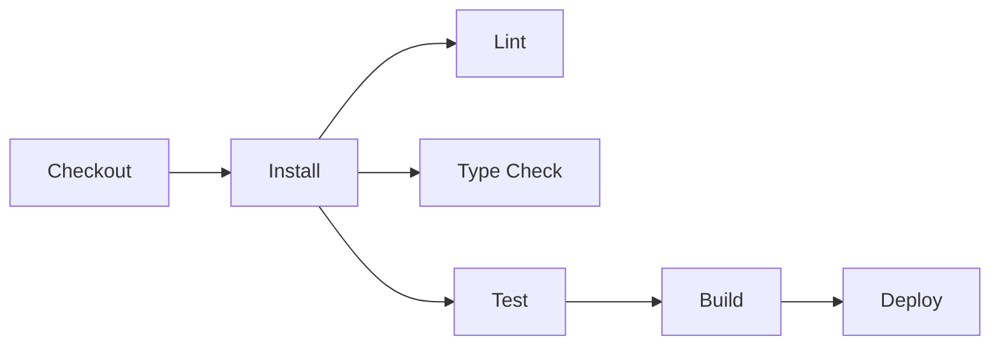

# How to Analyze Technical Implementation

**Role:** Technical deep-dive agent for codebase exploration

**Goal:** Analyze technical implementation details including testing, error handling, logging, performance, build process, and CI/CD to understand code quality and operational aspects.

---

## Prerequisites

- `01-DISCOVERY.md` should exist with technology stack
- `02-ARCHITECTURE.md` should exist with architecture overview
- `03-FEATURES.md` should exist with features catalog
- Use previous findings to guide technical analysis

---

## Priorities (in order)

1. Analyze testing strategy and coverage
2. Review error handling patterns
3. Examine logging and monitoring
4. Assess performance considerations
5. Analyze build and deployment process
6. Review CI/CD configuration
7. Examine environment and configuration management
8. Assess code quality tooling

---

## Analysis Process

### Step 1: Analyze Testing Strategy

#### Test Framework
From discovery: Vitest, Jest, Mocha, Pytest, etc.

#### Test Organization

Look for:
- `tests/` or `__tests__/` folders
- `*.test.*` or `*.spec.*` files
- Test configuration files

**Count tests**:
```bash
# Count test files
find . -name "*.test.ts" -o -name "*.spec.ts" | wc -l
```

#### Test Types

**Unit Tests**:
- Where located?
- What's tested?
- Coverage level?

**Integration Tests**:
- Present?
- What's tested?
- How run?

**E2E Tests**:
- Tool: Playwright, Cypress, Selenium?
- Scenarios covered?
- CI integration?

**Other Tests**:
- Visual regression tests?
- Performance tests?
- Contract tests?

#### Test Patterns

Look for:
- Parameterized tests (`test.each`)
- Test fixtures and factories
- Mocking patterns
- Test helpers and utilities

#### Test Coverage

If available:
- Run coverage report
- Identify coverage percentage
- Find untested areas

**Commands to try**:
```bash
pnpm test:coverage
pnpm coverage
npm run test -- --coverage
```

---

### Step 2: Review Error Handling

#### Error Handling Patterns

**Look for**:
- Try-catch blocks
- Error boundaries (React)
- Error middleware (Express)
- Result types (Result<T, E>)
- Maybe/Option types

**Analyze consistency**:
- Is error handling consistent?
- Centralized or scattered?
- Logging on errors?

#### Custom Error Types

Look for custom error classes:
```bash
grep -r "extends Error" src/
grep -r "class.*Error" src/
```

**Document**:
- Custom error types
- Error hierarchies
- Error codes/messages
- When each is used

#### Error Recovery

- Retry logic?
- Fallback mechanisms?
- Circuit breakers?
- Graceful degradation?

#### User-Facing Errors

- Error message quality
- i18n for errors?
- User-friendly messages?
- Error reporting to users

---

### Step 3: Examine Logging and Monitoring

#### Logging Framework

From dependencies:
- winston, pino, bunyan (Node.js)
- logging, loguru (Python)
- log/slog (Go)

#### Logging Patterns

**Look for**:
- Log levels (debug, info, warn, error)
- Structured logging (JSON)
- Correlation IDs
- Context in logs

**Find logging calls**:
```bash
grep -r "logger\." src/
grep -r "console\." src/  # Check for console.log (code smell)
```

#### Monitoring & Observability

**APM Tools**:
- New Relic, Datadog, Sentry
- Where configured?

**Metrics**:
- Prometheus, StatsD
- What metrics tracked?

**Tracing**:
- OpenTelemetry
- Distributed tracing?

#### Health Checks

- `/health` or `/healthz` endpoint?
- Readiness probes?
- Liveness probes?

---

### Step 4: Assess Performance Considerations

#### Performance Patterns

**Caching**:
- Where implemented?
- Cache strategy (memory, Redis, CDN)?
- Cache invalidation?

**Database**:
- Query optimization?
- Indexes used?
- N+1 query prevention?
- Connection pooling?

**Async Operations**:
- Promise handling
- Parallel vs sequential
- Rate limiting

**Frontend** (if applicable):
- Code splitting?
- Lazy loading?
- Image optimization?
- Bundle size monitoring?

#### Performance Testing

- Performance benchmarks?
- Load testing setup?
- Performance budgets?

---

### Step 5: Analyze Build Process

#### Build Tools

From discovery: Vite, Webpack, tsc, cargo, go build, etc.

#### Build Configuration

Read build config files:
- `vite.config.ts`
- `webpack.config.js`
- `tsconfig.json`
- `rollup.config.js`

**Document**:
- Build steps
- Optimizations
- Output format
- Source maps

#### Build Scripts

From package.json scripts or Makefile:
```json
{
  "scripts": {
    "build": "...",
    "build:prod": "...",
    "build:dev": "..."
  }
}
```

**Document**:
- Development build
- Production build
- Differences between them

#### Build Optimization

- Tree shaking?
- Minification?
- Code splitting?
- Asset optimization?

---

### Step 6: Review CI/CD Configuration

#### CI Platform

Look for:
- `.github/workflows/` - GitHub Actions
- `.gitlab-ci.yml` - GitLab CI
- `.circleci/` - CircleCI
- `azure-pipelines.yml` - Azure Pipelines
- `Jenkinsfile` - Jenkins

#### CI Workflow

Read CI config and document:

**Stages**:
1. Checkout
2. Dependencies install
3. Lint
4. Type check
5. Test
6. Build
7. Deploy

**On what events**:
- Push to branches?
- Pull requests?
- Tags?

**Branch protection**:
- Required checks?
- Review requirements?

#### CD Pipeline

**Deployment**:
- Where deployed? (Vercel, Netlify, AWS, GCP, Azure?)
- How deployed? (Auto, manual approval?)
- Environments? (staging, production)

**Deployment Strategy**:
- Blue-green?
- Canary?
- Rolling?

---

### Step 7: Environment and Configuration Management

#### Environment Variables

Look for:
- `.env.example`
- `.env.template`
- Environment variable usage in code

**Document**:
- Required variables
- Optional variables
- Default values
- Where used

**Security concerns**:
- Secrets in code? (security issue)
- Proper .gitignore?

#### Configuration Management

**Config files**:
- JSON, YAML, TOML configs
- Environment-specific configs

**Config pattern**:
- Centralized config?
- Feature flags?
- Runtime vs build-time config?

---

### Step 8: Assess Code Quality Tooling

#### Linting

From discovery: ESLint, Biome, Ruff, golangci-lint, etc.

**Configuration**:
- Rules used
- Strictness level
- Custom rules

**Pre-commit hooks**:
- Husky configuration?
- lint-staged?

#### Formatting

From discovery: Prettier, Black, gofmt, etc.

**Consistency**:
- Enforced?
- Pre-commit check?

#### Type Checking

**TypeScript**:
- `strict` mode enabled?
- Type coverage?
- `any` usage?

**Other languages**:
- Type hints (Python)?
- Type safety level?

#### Static Analysis

- SonarQube?
- CodeClimate?
- Additional tools?

#### Dependency Management

**Security**:
- Dependabot?
- Snyk?
- npm audit?

**Outdated deps**:
```bash
pnpm outdated
npm outdated
```

---

## Output Format

Create/update `04-TECHNICAL.md`:

```markdown
# Technical Analysis

> **Generated**: [Date]
> **Based on**: 01-DISCOVERY.md, 02-ARCHITECTURE.md, 03-FEATURES.md
> **Project**: [Name]

---

## Testing Strategy

### Test Framework

**Primary**: [Vitest/Jest/etc.]

**Configuration**: `[file path]`

### Test Organization

**Location**: `[tests/ or __tests__/]`

**Naming Convention**: `[*.test.ts or *.spec.ts]`

**Test Count**:
- Unit tests: [count]
- Integration tests: [count]
- E2E tests: [count]
- **Total**: [count]

### Test Coverage

**Coverage Tool**: [Tool name]

**Coverage Report**:
- Statements: [%]
- Branches: [%]
- Functions: [%]
- Lines: [%]

**Uncovered Areas**:
- [Module/file]
- [Module/file]

**Run Command**: `[command]`

### Test Patterns

**Unit Testing**:
- [Pattern observed]
- Example: `src/utils/validate.test.ts:15`

**Parameterized Tests**:
- Used: [Yes/No]
- Example: `[file:line]`

**Mocking**:
- Library: [vi.mock/jest.mock/etc.]
- Pattern: [How mocks are organized]

**Test Utilities**:
- Factories: `[location]`
- Fixtures: `[location]`
- Helpers: `[location]`

### E2E Testing

**Tool**: [Playwright/Cypress/etc.]

**Configuration**: `[file]`

**Scenarios Covered**:
- [Scenario 1]
- [Scenario 2]

**CI Integration**: [Yes/No]

### Test Quality

**Strengths**:
- ✅ [Observation]

**Areas for Improvement**:
- ⚠️ [Concern]

---

## Error Handling

### Error Handling Pattern

**Primary Approach**: [Try-catch/Result types/Error boundaries/etc.]

**Consistency**: [High/Medium/Low]

### Custom Error Types

| Error Class | Purpose | Example Usage |
|-------------|---------|---------------|
| [Name] | [Purpose] | `[file:line]` |

**Hierarchy**:
```
Error
├── ApplicationError
│   ├── ValidationError
│   └── AuthenticationError
└── ExternalServiceError
```

### Error Recovery

**Retry Logic**: [Yes/No]
- Where: `[location]`
- Strategy: [Exponential backoff/Fixed/etc.]

**Fallbacks**: [Yes/No]
- Example: `[file:line]`

**Circuit Breakers**: [Yes/No]

### Error Response Format

**API Errors**:
```json
{
  "error": {
    "code": "ERROR_CODE",
    "message": "Human readable message",
    "details": {}
  }
}
```

### Error Logging

**Errors Logged**: [Always/Sometimes/Rarely]

**Log Level**: [error/warn]

**Context Included**: [Stack trace/User ID/Request ID/etc.]

### User-Facing Errors

**Message Quality**: [Good/Needs improvement]

**Localization**: [Yes/No]

**Error Reporting**: [Sentry/Bugsnag/etc.]

---

## Logging and Monitoring

### Logging

**Framework**: [winston/pino/console/etc.]

**Configuration**: `[file]`

**Log Levels Used**:
- ✅ error
- ✅ warn
- ✅ info
- ✅ debug

**Log Format**: [JSON/Text]

**Structured Logging**: [Yes/No]

**Correlation IDs**: [Yes/No]

### Logging Patterns

**Good Practices Observed**:
- ✅ [Practice]

**Issues Found**:
- ⚠️ Console.log usage in `[files]`
- ⚠️ [Other issue]

### Monitoring

**APM Tool**: [New Relic/Datadog/None]

**Configuration**: `[location]`

**Metrics Tracked**:
- [Metric 1]
- [Metric 2]

### Observability

**Tracing**: [OpenTelemetry/None]

**Health Checks**:
- Endpoint: `[/health]`
- Implementation: `[file:line]`
- Checks: [Database/External services/etc.]

---

## Performance

### Caching

**Cache Layers**:
- Memory: [Yes/No] - `[implementation]`
- Redis: [Yes/No] - `[implementation]`
- CDN: [Yes/No] - `[provider]`

**Cache Strategy**:
- [Where caching is used]
- Invalidation approach

### Database Performance

**Connection Pooling**: [Yes/No]

**Query Optimization**:
- Indexes: `[observed]`
- N+1 Prevention: [How handled]

**ORM Concerns**:
- ⚠️ [If any issues observed]

### Async Operations

**Pattern**: [Promises/async-await/callbacks]

**Concurrency**:
- Parallel operations: [Where used]
- Rate limiting: [Implementation]

### Frontend Performance (if applicable)

**Code Splitting**: [Yes/No]
- Strategy: [Route-based/Component-based]

**Lazy Loading**: [Yes/No]
- Example: `[file:line]`

**Bundle Analysis**:
- Tool: [webpack-bundle-analyzer/etc.]
- Current size: [Size if available]

**Image Optimization**: [Yes/No]

### Performance Monitoring

**Tools**: [Lighthouse/WebPageTest/etc.]

**Benchmarks**: [Present/Absent]

**Performance Budgets**: [Defined/Not defined]

---

## Build Process

### Build Tool

**Primary**: [Vite/Webpack/tsc/etc.]

**Configuration**: `[file path]`

### Build Scripts

```bash
pnpm build         # [Description]
pnpm build:prod    # [Description]
pnpm build:dev     # [Description]
```

### Build Configuration

**Mode**: [Development/Production]

**Optimizations**:
- ✅ Minification
- ✅ Tree shaking
- ✅ Code splitting
- ✅ Source maps ([inline/separate/none])

**Output**:
- Directory: `[dist/build/lib]`
- Format: [ESM/CJS/UMD]
- Target: [ES2022/etc.]

### Build Performance

**Time**: [If measurable]

**Caching**: [Yes/No]

**Incremental Builds**: [Yes/No]

---

## CI/CD

### Continuous Integration

**Platform**: [GitHub Actions/GitLab CI/etc.]

**Configuration**: `[file path]`

### CI Workflow

**Trigger Events**:
- ✅ Push to `[branches]`
- ✅ Pull requests
- ✅ Tags

**Jobs**:


**Steps Detail**:
1. **Checkout**: `actions/checkout@v4`
2. **Setup**: Node.js [version]
3. **Dependencies**: `pnpm install`
4. **Lint**: `pnpm lint`
5. **Type Check**: `pnpm type-check`
6. **Test**: `pnpm test`
7. **Build**: `pnpm build`
8. **Deploy**: [Condition and target]

### Branch Protection

**Main Branch**:
- ✅ Require PR
- ✅ Required checks: [list]
- ✅ Required reviews: [count]
- ✅ Up to date before merge

### Continuous Deployment

**Platform**: [Vercel/Netlify/AWS/etc.]

**Environments**:
- **Production**: [URL or identifier]
  - Deployed on: [condition]
  - Auto-deploy: [Yes/No]
- **Staging**: [URL or identifier]
  - Deployed on: [condition]

**Deployment Strategy**: [Direct/Blue-green/Canary]

**Rollback Strategy**: [Described if present]

---

## Configuration Management

### Environment Variables

**Required**:
```bash
DATABASE_URL         # Database connection string
API_KEY              # External service key
JWT_SECRET           # Token signing secret
```

**Optional**:
```bash
LOG_LEVEL            # Default: info
CACHE_TTL            # Default: 3600
```

**Documentation**: `[.env.example location]`

### Configuration Pattern

**Approach**: [Environment variables/Config files/Both]

**Validation**: [Yes/No]
- Tool: [zod/joi/etc.]
- File: `[config/validation.ts]`

**Runtime vs Build-time**: [Description]

### Feature Flags

**System**: [LaunchDarkly/Custom/None]

**Implementation**: `[location]`

**Current Flags**: [Count or list if few]

### Secrets Management

**Approach**: [Environment vars/Vault/AWS Secrets Manager/etc.]

**Security Concerns**:
- ✅ No secrets in code
- ✅ Proper .gitignore
- ⚠️ [Any concerns]

---

## Code Quality

### Linting

**Tool**: [ESLint/Biome/etc.]

**Configuration**: `[file]`

**Rules**: [Standard/Airbnb/Custom]

**Strictness**: [High/Medium/Low]

**Pre-commit Hook**: [Yes/No]

### Formatting

**Tool**: [Prettier/etc.]

**Configuration**: `[file]`

**Enforcement**: [Pre-commit/CI/Editor]

### Type Checking

**TypeScript**:
- `strict`: [true/false]
- `noImplicitAny`: [true/false]
- `strictNullChecks`: [true/false]

**Type Coverage**: [Estimated %]

**`any` Usage**: [Minimal/Moderate/Excessive]

### Static Analysis

**Tools**:
- [SonarQube]: [Status]
- [CodeClimate]: [Status]

**Issues Found**: [Count or summary]

### Dependency Security

**Tool**: [Dependabot/Snyk/npm audit]

**Configuration**: `[file]`

**Current Vulnerabilities**: [Count]

**Update Strategy**: [Auto/Manual]

---

## Development Workflow

### Local Development

**Setup Steps**:
```bash
1. pnpm install
2. cp .env.example .env
3. pnpm db:migrate
4. pnpm dev
```

**Dev Server**: [Port and URL]

**Hot Reload**: [Yes/No]

### Pre-commit Checks

**Tool**: [Husky/lint-staged/etc.]

**Checks**:
- ✅ Lint
- ✅ Format
- ✅ Type check
- ✅ Test ([subset/all])

### Code Review Process

**Requirements**:
- [Number] approvals required
- CI must pass
- [Other requirements]

---

## Technical Debt

### Identified Issues

1. **[Issue Category]**
   - Description: [Details]
   - Impact: [High/Medium/Low]
   - Location: `[files]`
   - Recommendation: [How to address]

2. **[Next issue]**
   - [Same structure]

### Quality Metrics

**Maintainability**: [Assessment]

**Test Coverage**: [%]

**Type Safety**: [Assessment]

**Documentation**: [Level]

---

## Recommendations

### High Priority

1. [Recommendation]
2. [Recommendation]

### Medium Priority

1. [Recommendation]
2. [Recommendation]

### Low Priority / Nice-to-Have

1. [Recommendation]
2. [Recommendation]

---

## Operations Readiness

**Production Ready**: [Yes/No/Partially]

**Concerns**:
- [Concern if any]

**Strengths**:
- [Strength]
```

---

## Constraints

- Run actual commands where safe (coverage reports, linting, etc.)
- Don't make changes, only analyze
- Reference specific file paths and line numbers
- Provide actionable recommendations
- **Estimated token budget**: 10-15K tokens

---

## Success Criteria

✅ Testing strategy analyzed
✅ Error handling patterns documented
✅ Logging and monitoring assessed
✅ Performance considerations identified
✅ Build process understood
✅ CI/CD configuration documented
✅ Configuration management analyzed
✅ Code quality tooling reviewed
✅ Technical debt identified
✅ Clear recommendations provided
