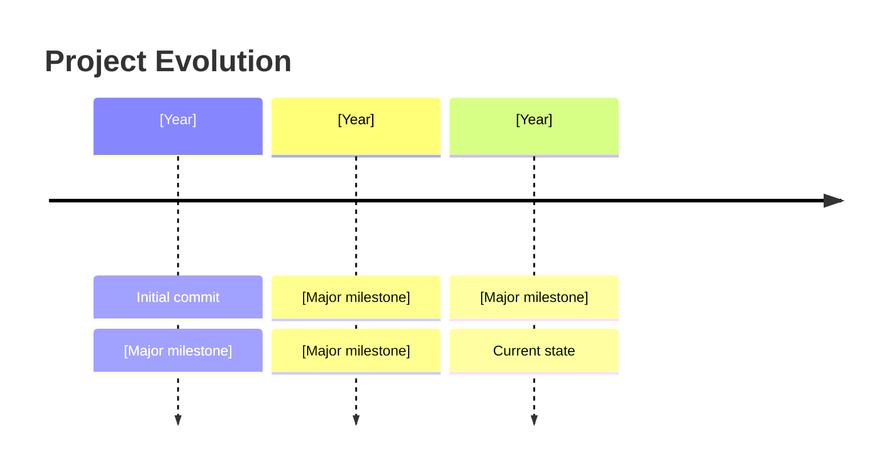

# How to Analyze Git History

**Role:** Git history analysis agent for codebase exploration

**Goal:** Understand project evolution, feature development timeline, contributor patterns, and historical context through git commit analysis.

---

## Prerequisites

- Project must be a git repository
- `01-DISCOVERY.md` should exist with project context
- Use previous findings to contextualize history analysis

Analyze the git commit history to understand how the project has evolved over time.

Create or update the file `HISTORY_ANALYSIS.md` in the project root with your findings about project timeline, contributors, feature evolution, and development patterns, then confirm completion.

---

## Priorities (in order)

1. Determine project age and activity level
2. Identify major milestones and releases
3. Analyze feature evolution timeline
4. Map contributor patterns and activity
5. Identify historical architecture changes
6. Document recent focus areas
7. Detect patterns in commit messages and development workflow

---

## Analysis Process

### Step 1: Project Age and Activity

#### Basic Stats

```bash
# First commit
git log --reverse --format="%ai %s" | head -1

# Last commit
git log -1 --format="%ai %s"

# Total commits
git rev-list --count HEAD

# Commits by month (last 12 months)
git log --since="12 months ago" --format="%ai" | awk '{print $1}' | cut -d'-' -f1-2 | sort | uniq -c

# Active branches
git branch -a | wc -l
```

**Document**:
- First commit date
- Project age (duration)
- Total commits
- Commit frequency
- Active development (recent commits)

---

### Step 2: Contributors Analysis

#### Contributor Stats

```bash
# All contributors
git shortlog -sn --all

# Active contributors (last 6 months)
git shortlog -sn --since="6 months ago"

# Contributor activity over time
git log --format="%an" | sort | uniq -c | sort -rn

# Commits per author
git log --format='%aN' | sort | uniq -c | sort -rn
```

**Document**:
- Total contributors
- Active contributors (last 6 months)
- Top contributors
- Contributor diversity
- Core team size

#### Contributor Patterns

```bash
# Files changed by author
git log --author="[name]" --pretty=format: --name-only | sort | uniq -c | sort -rn | head -20

# Commit times (work hours analysis)
git log --format="%ai" | cut -d' ' -f2 | cut -d':' -f1 | sort | uniq -c
```

---

### Step 3: Major Milestones and Releases

#### Tags and Releases

```bash
# List all tags with dates
git tag -l --sort=-creatordate --format='%(creatordate:short) %(refname:short)'

# Latest release
git describe --tags --abbrev=0

# Commits since last release
git log $(git describe --tags --abbrev=0)..HEAD --oneline | wc -l

# Release frequency
git tag -l | wc -l
```

**Document**:
- Current version
- Release count
- Release frequency
- Recent releases

#### Semantic Versioning Pattern

Analyze if following semver:
- Major releases (breaking changes)
- Minor releases (features)
- Patch releases (fixes)

---

### Step 4: Feature Evolution Timeline

#### Conventional Commits Analysis

If using conventional commits:

```bash
# Feature commits
git log --oneline --grep="^feat"

# Bug fixes
git log --oneline --grep="^fix"

# Breaking changes
git log --oneline --grep="BREAKING CHANGE"

# Refactoring
git log --oneline --grep="^refactor"

# Count by type
git log --oneline | grep -E "^[a-f0-9]+ (feat|fix|docs|style|refactor|test|chore)" | cut -d' ' -f2 | cut -d':' -f1 | sort | uniq -c | sort -rn
```

**Commit Type Distribution**:
- feat: [count] ([%])
- fix: [count] ([%])
- refactor: [count] ([%])
- docs: [count] ([%])
- chore: [count] ([%])
- test: [count] ([%])

#### Major Features Timeline

Identify significant features by analyzing commit messages:

```bash
# Recent features (last 6 months)
git log --since="6 months ago" --oneline --grep="^feat" --format="%ai %s"

# Group by scope if present (feat(scope):)
git log --oneline --grep="^feat" | sed 's/feat(\([^)]*\)).*/\1/' | sort | uniq -c | sort -rn
```

---

### Step 5: Code Churn Analysis

#### File Change Frequency

```bash
# Most changed files
git log --pretty=format: --name-only | sort | uniq -c | sort -rn | head -30

# Recent file changes (last 3 months)
git log --since="3 months ago" --pretty=format: --name-only | sort | uniq -c | sort -rn | head -20

# Large changes
git log --all --numstat --format="%H" | awk 'NF==3 {plus+=$1; minus+=$2} END {printf("+%d, -%d\n", plus, minus)}'
```

**Document**:
- Frequently changed files
- Hotspot areas (high churn)
- Stable areas (low churn)

#### Lines Changed Over Time

```bash
# Additions/deletions by month
git log --since="12 months ago" --numstat --pretty="%ad" --date=short | awk '!/^[0-9]/ {month=$1} /^[0-9]/ {files[month]+=$1+$2} END {for (m in files) print m, files[m]}' | sort
```

---

### Step 6: Architecture Evolution

#### Directory Changes Over Time

```bash
# When were major directories created?
git log --diff-filter=A --name-only --format="%ai" -- "src/*" | head -1
git log --diff-filter=A --name-only --format="%ai" -- "tests/*" | head -1

# Recent directory additions
git log --since="6 months ago" --diff-filter=A --name-only --format="%ai %s" | grep "/$"
```

#### Major Refactorings

```bash
# Large refactoring commits
git log --oneline --grep="refactor" --since="1 year ago"

# Moves/renames
git log --since="6 months ago" --diff-filter=R --stat --oneline
```

**Document**:
- When major directories created
- Significant refactorings
- Architecture shifts

---

### Step 7: Recent Focus Areas

#### Last 3 Months Activity

```bash
# Recent commits by file
git log --since="3 months ago" --pretty=format: --name-only | sort | uniq -c | sort -rn | head -20

# Recent commit messages
git log --since="3 months ago" --oneline | head -50

# Recent authors
git shortlog -sn --since="3 months ago"
```

**Document**:
- What's being worked on recently?
- Active development areas
- Current priorities (inferred)

---

### Step 8: Commit Message Quality

#### Commit Message Analysis

```bash
# Average commit message length
git log --format="%s" | awk '{sum+=length; count++} END {print sum/count}'

# Commits with detailed body
git log --format="%b" | grep -c "^."

# Short commits (potential issue)
git log --format="%s" | awk 'length < 10 {print}' | wc -l
```

**Assess**:
- Message quality: [Good/Average/Poor]
- Conventional commits: [Used/Not used]
- Detailed explanations: [Common/Rare]

---

### Step 9: Branch Strategy

#### Branching Pattern

```bash
# Branch names
git branch -a

# Long-lived branches
git for-each-ref --sort=-committerdate refs/heads/ --format='%(refname:short) %(committerdate:relative)'

# Branch prefixes (feature/, fix/, etc.)
git branch -a | sed 's/.*\///' | cut -d'/' -f1 | sort | uniq -c
```

**Document**:
- Main branch: [main/master]
- Branch naming convention: [feature/, fix/, etc.]
- Long-lived branches: [develop, staging, etc.]
- Branch count: [active branches]

---

### Step 10: Development Velocity

#### Velocity Metrics

```bash
# Commits per week (last 12 weeks)
git log --since="12 weeks ago" --format="%ai" | awk '{print $1}' | cut -d'-' -f1-2 | sort | uniq -c

# Average time between commits
git log --format="%at" | sort -n | awk '{if(prev) {sum+=$1-prev; count++} prev=$1} END {print sum/count/3600 " hours"}'

# Merge commits (integration frequency)
git log --merges --oneline | wc -l
```

**Document**:
- Recent velocity
- Velocity trends
- Integration frequency

---

## Output Format

Create/update `HISTORY_ANALYSIS.md`:

```markdown
# Git History Analysis

> **Generated**: [Date]
> **Repository**: [Name]
> **Current Branch**: [Branch]

---

## Project Timeline

**First Commit**: [Date]

**Project Age**: [X years, Y months]

**Total Commits**: [Count]

**Latest Commit**: [Date and message]

**Activity Status**: [Very Active/Active/Moderate/Low]

---

## Timeline Visualization



---

## Contributor Analysis

### Overall Contributors

**Total Contributors**: [Count]

**Active Contributors** (last 6 months): [Count]

**Core Team**: [Count of top contributors]

### Top Contributors

| Contributor | Total Commits | % of Total | Last Activity |
|-------------|---------------|------------|---------------|
| [Name] | [Count] | [%] | [Date] |
| [Name] | [Count] | [%] | [Date] |
| [Name] | [Count] | [%] | [Date] |

### Contributor Activity


### Contributor Patterns

**Work Hours**: [Observation about commit times]

**Contributor Stability**: [New contributors joining? Core team stable?]

---

## Releases and Milestones

### Versioning

**Current Version**: [Version]

**Versioning Scheme**: [Semver/CalVer/Custom]

**Total Releases**: [Count]

### Recent Releases

| Version | Date | Type | Highlights |
|---------|------|------|------------|
| [v1.2.3] | [Date] | Minor | [Key features] |
| [v1.2.2] | [Date] | Patch | [Bug fixes] |
| [v1.2.0] | [Date] | Minor | [New features] |

### Release Frequency

**Average Time Between Releases**: [Duration]

**Release Pattern**: [Regular/Irregular]

---

## Feature Evolution

### Commit Type Distribution

| Type | Count | Percentage |
|------|-------|------------|
| feat | [count] | [%] |
| fix | [count] | [%] |
| refactor | [count] | [%] |
| docs | [count] | [%] |
| test | [count] | [%] |
| chore | [count] | [%] |

### Major Features Timeline

#### [Year]

- **[Month]**: [Feature added]
- **[Month]**: [Feature added]

#### [Year]

- **[Month]**: [Feature added]
- **[Month]**: [Feature added]

### Feature Scopes

Top areas of feature development:

1. **[Scope]**: [Count] features
2. **[Scope]**: [Count] features
3. **[Scope]**: [Count] features

---

## Code Churn Analysis

### Most Changed Files

| File | Changes | Assessment |
|------|---------|------------|
| [file] | [count] | [Hotspot/Normal] |
| [file] | [count] | [Hotspot/Normal] |

### Churn Patterns

**High Churn Areas**:
- `[directory/]` - [Why - bug-prone/under development/etc.]
- `[directory/]` - [Why]

**Stable Areas**:
- `[directory/]` - [Observation]
- `[directory/]` - [Observation]

### Lines Changed Trend

```mermaid
xychart-beta
    title "Code Changes Over Time"
    x-axis [Jan, Feb, Mar, Apr, May, Jun, Jul, Aug, Sep, Oct, Nov, Dec]
    y-axis "Lines Changed"
    line [count, count, count, ...]
```

---

## Architecture Evolution

### Major Milestones

**[Date]**: [Architectural change or milestone]
- Details: [What changed]
- Impact: [How it affected the codebase]

**[Date]**: [Next milestone]
- Details: [What changed]
- Impact: [How it affected the codebase]

### Refactoring History

**Recent Refactorings** (last year):

1. **[Date]**: [Description]
   - Commit: `[hash]`
   - Scope: [What was refactored]

2. **[Date]**: [Description]
   - Commit: `[hash]`
   - Scope: [What was refactored]

### Technology Migrations

If any migrations detected:

**[Date]**: [Technology A] → [Technology B]
- Reason (inferred): [Why]
- Duration: [How long]
- Completion: [Fully/Partially migrated]

---

## Recent Focus Areas

### Last 3 Months

**Most Active Areas**:
1. `[directory/module]` - [X commits]
2. `[directory/module]` - [X commits]
3. `[directory/module]` - [X commits]

**Recent Features**:
- [Feature from commit messages]
- [Feature from commit messages]

**Recent Fixes**:
- [Common fix patterns]
- [Areas receiving fixes]

**Current Priorities** (inferred):
- [Priority 1]
- [Priority 2]

---

## Development Patterns

### Branch Strategy

**Main Branch**: `[main/master]`

**Branch Naming**: [Convention used]

**Common Prefixes**:
- `feature/` - [Count]
- `fix/` - [Count]
- `chore/` - [Count]

**Long-Lived Branches**:
- `[branch]` - [Purpose]
- `[branch]` - [Purpose]

### Commit Message Quality

**Quality Assessment**: [Good/Average/Needs Improvement]

**Conventional Commits**: [✅ Used / ❌ Not used]

**Average Message Length**: [X characters]

**Detailed Bodies**: [Common/Rare]

**Issues**:
- [If any patterns of poor messages]

---

## Development Velocity

### Commit Frequency

**Recent Activity**:
- Last week: [X commits]
- Last month: [X commits]
- Last 3 months: [X commits]

**Average**: [X commits per week]

### Velocity Trends

```mermaid
xychart-beta
    title "Commit Activity (Last 12 Weeks)"
    x-axis [W1, W2, W3, W4, W5, W6, W7, W8, W9, W10, W11, W12]
    y-axis "Commits"
    line [count, count, count, ...]
```

**Trend**: [Increasing/Stable/Decreasing]

**Observation**: [Context about velocity]

### Integration Frequency

**Merge Commits**: [Count]

**Average Time to Merge**: [Duration, if calculable]

**Integration Pattern**: [Continuous/Batched/etc.]

---

## Key Insights

### Historical Strengths

- ✅ [Observation]
- ✅ [Observation]

### Historical Concerns

- ⚠️ [Concern]
- ⚠️ [Concern]

### Evolution Summary

[2-3 paragraph narrative about how the project has evolved, key turning points, and trajectory]

---

## Project Maturity Assessment

**Phase**: [Early/Growth/Mature/Maintenance]

**Indicators**:
- Commit frequency: [Assessment]
- Feature development: [Active/Slowing/Stopped]
- Refactoring activity: [High/Medium/Low]
- Bug fix ratio: [Increasing/Stable/Decreasing]
- Architecture stability: [Evolving/Stable]

**Overall Maturity**: [Rating and explanation]

---

## Recommendations

Based on history analysis:

1. [Recommendation based on patterns]
2. [Recommendation based on patterns]
3. [Recommendation based on patterns]

---

## Historical Context for New Developers

### Origin Story

[Brief narrative about project origins based on early commits]

### Major Evolution Points

1. **[Date/Period]**: [What happened]
2. **[Date/Period]**: [What happened]
3. **[Date/Period]**: [What happened]

### What to Read from History

Suggested commits to review:

- `[hash]` - [Why important - initial architecture]
- `[hash]` - [Why important - major feature]
- `[hash]` - [Why important - significant refactor]

### Historical Gotchas

Lessons from history:

- [Pattern or issue that recurred]
- [Area that's been refactored multiple times - may be complex]
```

---

## Constraints

- Use git commands only - no modification of repository
- Focus on patterns and insights, not exhaustive listing
- Provide context and narrative, not just statistics
- Connect history to current codebase state
- **Estimated token budget**: 10-15K tokens

---

## Success Criteria

✅ Project timeline established
✅ Contributor patterns analyzed
✅ Release history documented
✅ Feature evolution mapped
✅ Code churn patterns identified
✅ Architecture changes tracked
✅ Recent focus areas identified
✅ Development velocity assessed
✅ Historical insights provided
✅ Context for new developers created
