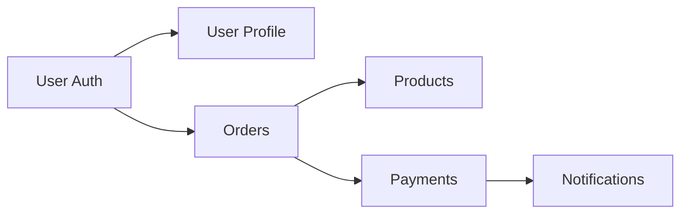
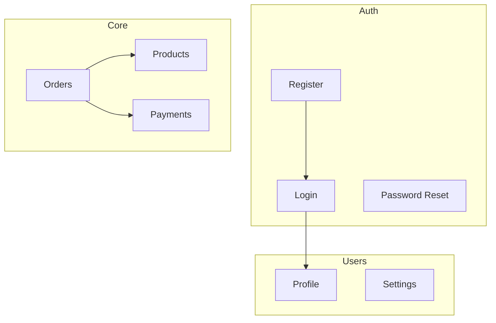
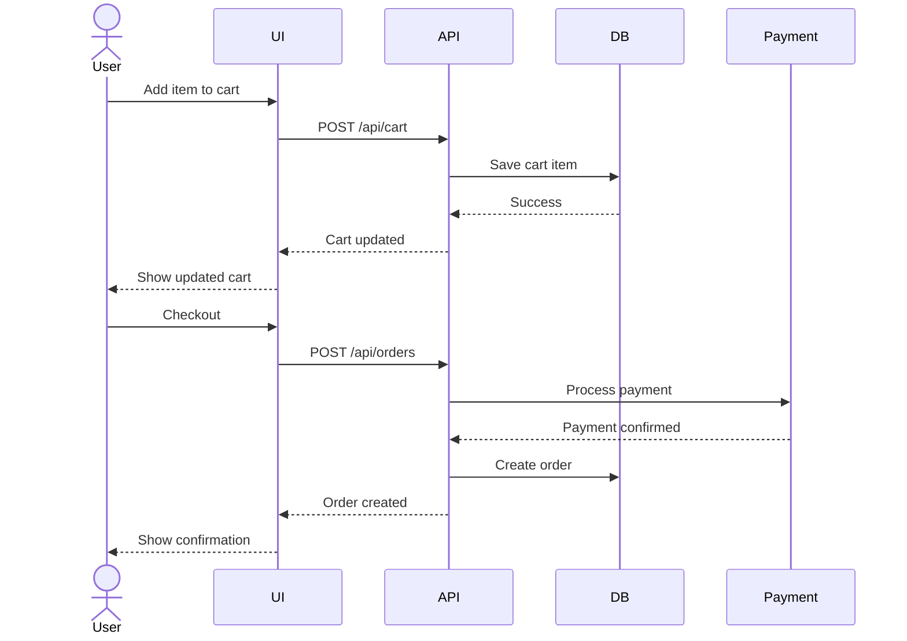
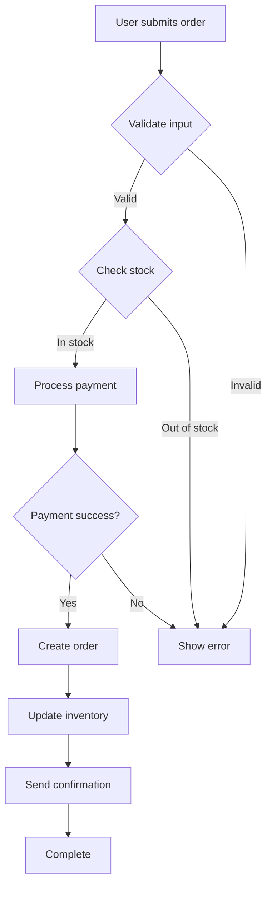
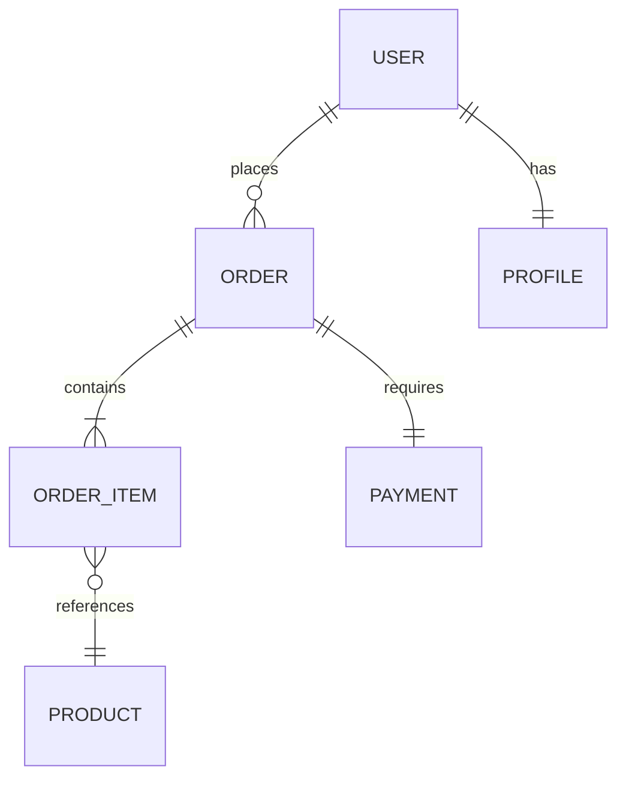

---

# How to Inventory Features

**Role:** Feature cataloging agent for codebase exploration

**Goal:** Identify and document all features, capabilities, user journeys, and business logic to understand what the system does.

---

## Prerequisites

- `01-DISCOVERY.md` should exist with technology stack
- `02-ARCHITECTURE.md` should exist with component structure
- Use previous findings to guide feature analysis

---

## Priorities (in order)

1. Identify all major features and capabilities
2. Map user journeys (if user-facing)
3. Catalog API endpoints and their purposes
4. Analyze business logic and domain models
5. Document feature organization
6. Map feature dependencies
7. Generate Mermaid sequence and flow diagrams

---

## Analysis Process

### Step 1: Identify Feature Organization

Determine how features are organized:

**By Type** (traditional):
- `controllers/`, `services/`, `models/`
- Features scattered across layers

**By Feature** (modular):
- `features/users/`, `features/products/`
- Each feature self-contained

**By Domain** (DDD):
- `domains/ordering/`, `domains/inventory/`
- Bounded contexts

**Hybrid**:
- Combination of approaches

---

### Step 2: Catalog Features

#### Backend Features

Look in:
- **Route definitions**: What endpoints exist?
- **Controllers/Handlers**: What operations?
- **Services**: What business capabilities?
- **Use cases**: What user actions?

For each feature, identify:
- **Name**: [Feature name]
- **Purpose**: [What it does]
- **User-facing or internal?**
- **CRUD operations**: Create, Read, Update, Delete?
- **Special operations**: Complex workflows?

Common feature categories:
- Authentication (login, logout, password reset)
- User management (profile, preferences, roles)
- Data management (CRUD for entities)
- Search and filtering
- Reporting and analytics
- Notifications
- File upload/download
- Integration with external services
- Batch processing
- Scheduled tasks

#### Frontend Features

Look in:
- **Pages/Routes**: What user can navigate to?
- **Components**: What UI capabilities?
- **Forms**: What data entry?
- **Dashboards**: What visualizations?

Common feature categories:
- User authentication flows
- Data browsing and search
- Forms and data entry
- Data visualization
- User preferences
- Real-time updates
- File management
- Notifications

---

### Step 3: Map API Endpoints

For each endpoint, document:

**Backend APIs**:

| Method | Path | Feature | Purpose | Auth | Request | Response |
|--------|------|---------|---------|------|---------|----------|
| GET | /api/users | Users | List users | Yes | Query params | User array |
| POST | /api/users | Users | Create user | Yes | User data | Created user |

Group by feature/domain for clarity.

**GraphQL** (if applicable):
- Queries
- Mutations
- Subscriptions

---

### Step 4: Analyze User Journeys

For user-facing features, trace complete journeys:

#### Journey: [Name]

**Goal**: [What user wants to accomplish]

**Steps**:
1. [User action] → [System response]
2. [User action] → [System response]
3. [User action] → [System response]

**Success Criteria**: [What indicates success]

**Error Paths**: [What can go wrong]

**Dependencies**: [Required features/permissions]

Examples:
- User registration flow
- Purchase flow
- Search and filter flow
- Content creation flow
- Admin approval flow

---

### Step 5: Analyze Business Logic

Look in:
- Services
- Use cases
- Domain models
- Validators
- Business rules

For each business capability:

**Capability**: [Name]

**Purpose**: [Business goal]

**Rules**:
- [Rule 1]
- [Rule 2]

**Validations**:
- [Validation 1]
- [Validation 2]

**Side Effects**:
- [What else happens]

**Example**:
```
Feature: Order Processing
Rules:
  - Must have items
  - Total must exceed minimum
  - Payment must be valid
Side Effects:
  - Inventory updated
  - Email sent
  - Analytics tracked
```

---

### Step 6: Identify Domain Models

Analyze entities and their relationships:

**Entities**:
- User, Product, Order, etc.

For each entity:
**Name**: [Entity]
**Attributes**: [Key fields]
**Relationships**: [To other entities]
**Business Rules**: [Constraints]

---

### Step 7: Map Feature Dependencies

Identify dependencies between features:



**Critical Features**:
- Features that many others depend on
- Must-work features

**Optional Features**:
- Can be disabled without breaking core

---

### Step 8: Analyze Integration Points

External service integrations:

**Service**: [Name]
**Purpose**: [Why integrated]
**Used By**: [Which features]
**API Type**: [REST/GraphQL/SDK]
**Auth Method**: [How authenticated]

Examples:
- Payment processors (Stripe, PayPal)
- Email services (SendGrid, Mailgun)
- Storage (S3, Cloudinary)
- Analytics (Google Analytics, Mixpanel)
- Authentication (Auth0, Firebase)

---

### Step 9: Document Permissions & Roles

If auth/authz exists:

**Roles**:
- Admin, User, Guest, etc.

**Permissions**:
| Role | Feature | Actions Allowed |
|------|---------|-----------------|
| Admin | Users | All |
| User | Profile | Own only |
| Guest | Products | Read only |

**Authorization Pattern**:
- Role-based (RBAC)
- Permission-based
- Attribute-based (ABAC)
- Custom

---

### Step 10: Generate Mermaid Diagrams

#### Diagram 1: Feature Map



#### Diagram 2: User Journey (Sequence)



#### Diagram 3: Feature Flow (Complex Operation)



---

## Output Format

Create/update `03-FEATURES.md`:

```markdown
# Features Inventory

> **Generated**: [Date]
> **Based on**: 01-DISCOVERY.md, 02-ARCHITECTURE.md
> **Project**: [Name]

---

## Feature Overview

**Total Features**: [Count]

**Categories**:
- Authentication: [Count]
- User Management: [Count]
- [Domain]: [Count]
- [Domain]: [Count]

---

## Feature Catalog

### Authentication & Authorization

#### Login

**Purpose**: [Description]

**Endpoints**:
- `POST /api/auth/login` - Authenticate user

**User Journey**:
1. User enters credentials
2. System validates
3. System issues token
4. User redirected to dashboard

**Business Rules**:
- Email must be verified
- Password must meet complexity requirements
- Max 5 failed attempts per hour

**Dependencies**:
- Email service (for verification)

**Implementation**: `src/features/auth/login.ts:45`

---

#### [Next feature]

[Same structure]

---

## API Endpoints

### Authentication APIs

| Method | Path | Purpose | Auth | Request | Response |
|--------|------|---------|------|---------|----------|
| POST | /api/auth/login | Login | No | Credentials | Token + User |
| POST | /api/auth/register | Register | No | User data | User |
| POST | /api/auth/logout | Logout | Yes | - | Success |

### [Category] APIs

[Same table format]

---

## User Journeys

### Journey: User Registration

```mermaid
sequenceDiagram
    [Sequence diagram]
```

**Description**:
[Explanation of the flow]

**Success Path**:
1. [Step]
2. [Step]

**Error Paths**:
- Email already exists → Show error
- Invalid password → Show requirements

**Touchpoints**:
- Registration form
- Email verification
- Welcome page

---

### Journey: [Next journey]

[Same structure]

---

## Feature Map

```mermaid
graph TB
    [Feature dependency diagram]
```

**Critical Path Features**:
- [Feature] - Required for basic functionality
- [Feature] - Core business logic

**Optional Features**:
- [Feature] - Enhancement
- [Feature] - Nice-to-have

---

## Business Logic

### Order Processing

**Location**: `src/services/orders/process.ts`

**Purpose**: Handle complete order lifecycle

**Process Flow**:

```mermaid
flowchart TD
    [Process flow diagram]
```

**Business Rules**:
1. Minimum order amount: $10
2. Maximum items per order: 100
3. Stock must be available
4. Payment must clear before fulfillment

**Validations**:
- Cart not empty
- All items still available
- Shipping address valid
- Payment method valid

**Side Effects**:
- Inventory reduced
- Payment processed
- Order confirmation email sent
- Analytics event tracked
- Seller notification sent

---

## Domain Models

### User

**Attributes**:
- `id`: UUID
- `email`: string (unique)
- `name`: string
- `role`: enum (admin, user)
- `createdAt`: timestamp

**Relationships**:
- Has many Orders
- Has one Profile
- Belongs to Organization (optional)

**Business Rules**:
- Email must be unique
- Cannot delete user with active orders

---

### [Next model]

[Same structure]

---

## Entity Relationships



---

## Integration Points

### Stripe (Payment Processing)

**Purpose**: Process payments for orders

**Used By**: Order feature, Subscription feature

**API**: REST

**Auth**: API key

**Operations**:
- Create payment intent
- Confirm payment
- Refund payment

**Implementation**: `src/services/payments/stripe.ts`

---

## Permissions Matrix

| Role | Feature | Create | Read | Update | Delete |
|------|---------|--------|------|--------|--------|
| Admin | Users | ✅ | ✅ | ✅ | ✅ |
| Admin | Products | ✅ | ✅ | ✅ | ✅ |
| User | Profile | Own | Own | Own | Own |
| User | Orders | ✅ | Own | Own | ❌ |
| Guest | Products | ❌ | ✅ | ❌ | ❌ |

**Authorization Pattern**: Role-Based Access Control (RBAC)

**Implementation**: Middleware at `src/middleware/auth.ts:78`

---

## Feature Completeness

### Fully Implemented

- ✅ Authentication (login, register, logout)
- ✅ User profile management
- ✅ Product browsing
- ✅ Order creation

### Partially Implemented

- ⚠️ Search (basic only, no filters)
- ⚠️ Notifications (email only, no in-app)

### Planned/Incomplete

- 📋 Advanced analytics dashboard
- 📋 Bulk operations
- 📋 Export functionality

---

## Feature Quality Observations

### Strengths

- ✅ Well-organized by feature
- ✅ Clear separation of concerns
- ✅ Comprehensive validation

### Areas for Improvement

- ⚠️ Some features lack error handling
- ⚠️ Inconsistent validation patterns
- ⚠️ Limited test coverage for edge cases

---

## Recommendations

1. **Add missing error handling** in order processing flow
2. **Standardize validation** approach across features
3. **Document API contracts** with OpenAPI spec
4. **Add integration tests** for critical user journeys
5. **Implement feature flags** for gradual rollouts

---

## Questions for Technical Phase

- How are feature flags managed?
- What's the test coverage for each feature?
- Are there performance benchmarks?
- How are errors logged and monitored?
```

---

## Constraints

- Focus on **what** the system does, not **how** it's implemented (that's technical phase)
- Use sequence diagrams for user journeys
- Use flowcharts for complex business logic
- Reference specific file paths and line numbers
- **Estimated token budget**: 15-25K tokens

---

## Success Criteria

✅ All features cataloged
✅ API endpoints documented
✅ User journeys mapped
✅ Business logic analyzed
✅ Domain models identified
✅ Integration points documented
✅ Multiple Mermaid diagrams generated
✅ Permissions matrix created
✅ Clear recommendations provided
